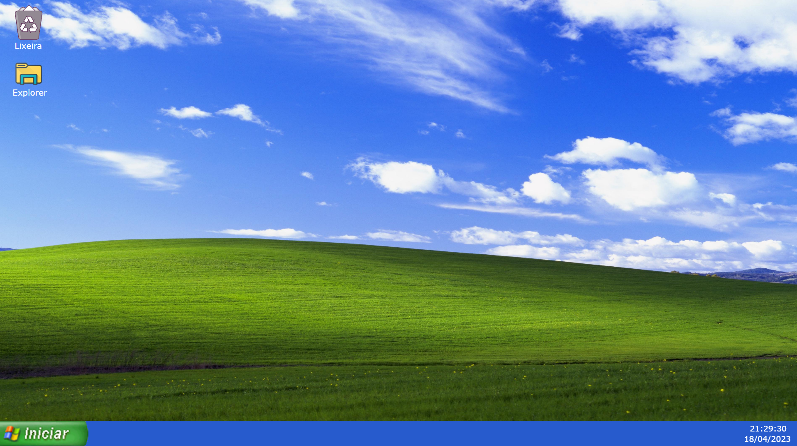

# WindowsXP 

# Welcome 👋🏻 

A small project, to teach a great history

# Project

**Work done by students from Etec de Poá - 1º INFONET 2022 💻**

The project aims to transmit knowledge about "The History of Computing". The Windows XP interface was used as a teaching tool to improve the user experience,
including interactive icons of the operating system itself, which when clicked open a tab with information.
**HTML, CSS, Google Images and JavaScript were used to create the web interface.**

# Members🚀

- Caio Custodio Parolin
- Leonardo Moreira Nakashima Monteiro
- Rafael Santos Rodrigues
- Rebeca Martins Caroba